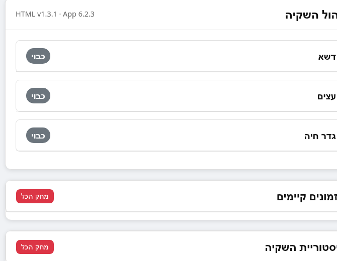
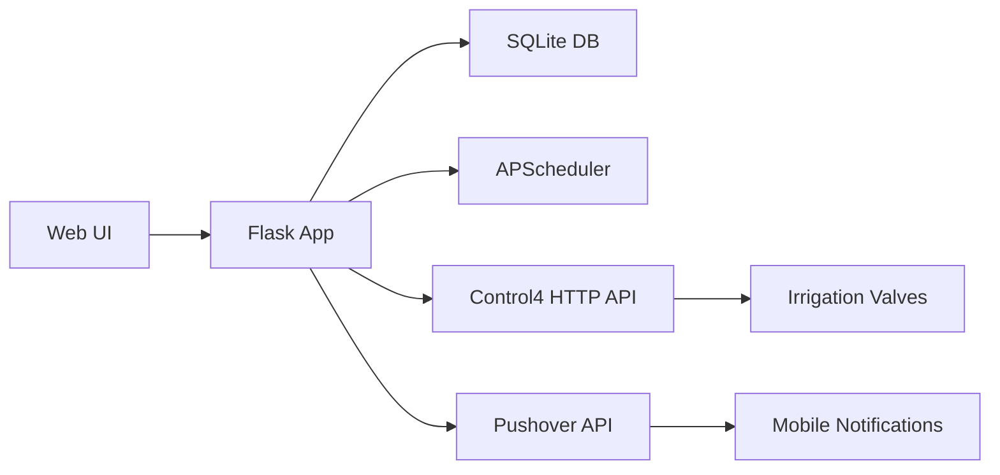

<div align="center">

# 💧 Irrigation Web App

### Smart Irrigation Management System for Home Automation

[](https://github.com/rayalon1984/irrigation-web-app/releases)
[](https://www.python.org/)
[](https://flask.palletsprojects.com/)
[](LICENSE)



*Modern, responsive web interface with Hebrew RTL support and automatic dark mode*

</div>

---

## 🌟 Features

<table>
<tr>
<td width="50%">

### 🎮 **Manual Control**
- Instant start/stop for all zones
- Custom duration settings
- Real-time status updates
- Emergency stop capability

</td>
<td width="50%">

### ⏰ **Smart Scheduling**
- One-time irrigation events
- Recurring schedules (daily/weekly)
- Flexible date ranges
- Automatic execution

</td>
</tr>
<tr>
<td width="50%">

### 🔧 **Auto-Recovery**
- Detects stuck irrigation zones
- Auto-stops on app restart
- Calculates accurate durations
- Prevents water waste

</td>
<td width="50%">

### 📊 **History & Monitoring**
- Complete irrigation logs
- Duration tracking
- Health check endpoint
- Real-time notifications

</td>
</tr>
</table>

## 🏡 Irrigation Zones

| Zone | Hebrew | Control4 ID |
|------|---------|-------------|
| 🌱 **Lawn** | דשא | grass |
| 🌳 **Trees** | עצים | trees |
| 🌿 **Hedge** | גדר חיה | rocks |

---

## 🚀 Quick Start

### Prerequisites

```bash
# System requirements
- Raspberry Pi (or any Linux system)
- Python 3.11+
- Control4 Smart Home system
- Pushover account (for notifications)
```

### Installation

```bash
# 1️⃣ Clone the repository
git clone git@github.com:rayalon1984/irrigation-web-app.git
cd irrigation-web-app

# 2️⃣ Create virtual environment
python3 -m venv venv
source venv/bin/activate

# 3️⃣ Install dependencies
pip install -r requirements.txt

# 4️⃣ Configure environment variables
cp .env.example .env
nano .env  # Replace example URLs with your actual Control4 IPs and ports

# 5️⃣ Set up Pushover credentials
cp config_example.py config.py
nano config.py  # Add your actual Pushover tokens

# 6️⃣ Run the app
python irrigation_app.py
```

### Access the Dashboard

```
🌐 http://localhost:5080
```

---

## ⚙️ Configuration

### 📝 Environment Variables (`.env`)

```bash
DB_PATH=irrigation.db

# Control4 URLs - Lawn Zone
C4_LAWN_START=http://192.168.1.100:8080/grass1
C4_LAWN_STOP=http://192.168.1.100:8080/grass0

# Control4 URLs - Trees Zone
C4_TREES_START=http://192.168.1.100:8080/trees1
C4_TREES_STOP=http://192.168.1.100:8080/trees0

# Control4 URLs - Hedge Zone
C4_HEDGE_START=http://192.168.1.100:8080/rocks1
C4_HEDGE_STOP=http://192.168.1.100:8080/rocks0
```

### 📱 Pushover Notifications (`config.py`)

```python
PUSHOVER_APP_TOKEN = "your_app_token_here"
PUSHOVER_USER_KEY = "your_user_key_here"
```

Get your tokens from [Pushover.net](https://pushover.net/)

---

## 🏗️ Architecture



### 🛠️ Tech Stack

| Component | Technology | Purpose |
|-----------|-----------|---------|
| **Backend** | Flask 3.1.1 | Web framework |
| **Scheduler** | APScheduler 3.11.0 | Job scheduling |
| **Database** | SQLite3 | Data persistence |
| **UI** | HTML5 + CSS3 | Responsive interface |
| **Notifications** | Pushover API | Push alerts |
| **Smart Home** | Control4 HTTP | Device control |

### 🗄️ Database Schema

```sql
-- Current status of each zone
CREATE TABLE status (
    zone TEXT PRIMARY KEY,
    state TEXT,           -- 'on' or 'off'
    start_ts TEXT         -- ISO timestamp
);

-- Scheduled irrigation jobs
CREATE TABLE schedules (
    id INTEGER PRIMARY KEY,
    zone TEXT,
    start_date TEXT,      -- YYYY-MM-DD
    start_time TEXT,      -- HH:MM
    duration INTEGER,     -- minutes
    interval_days INTEGER,-- 0 for one-time
    end_date TEXT         -- optional
);

-- Complete irrigation history
CREATE TABLE history (
    id INTEGER PRIMARY KEY,
    zone TEXT,
    start_ts TEXT,
    duration INTEGER      -- actual minutes run
);
```

---

## 🔌 API Reference

### Status Reporting

```http
GET /api/report_status/<zone>/<state>
```

**Parameters:**
- `zone`: `lawn`, `trees`, or `hedge`
- `state`: `on` or `off`

**Response:**
```json
{"status": "reported"}
```

**Example:**
```bash
curl http://localhost:5080/api/report_status/lawn/on
```

---

### Schedule Management

#### Create Schedule

```http
POST /api/schedule
Content-Type: application/json
```

**Body:**
```json
{
  "zone": "lawn",
  "start_date": "2025-12-03",
  "start_time": "06:00",
  "duration": 30,
  "interval_days": 2,
  "end_date": "2025-12-31"
}
```

#### Delete Item

```http
POST /api/delete/<table>/<id>
```

**Example:**
```bash
curl -X POST http://localhost:5080/api/delete/schedules/5
```

#### Clear All

```http
POST /api/clear/<table>
```

**Example:**
```bash
curl -X POST http://localhost:5080/api/clear/history
```

---

### Health Check

```http
GET /health
```

**Response:**
```json
{
  "ok": true,
  "version": "6.2.3",
  "jobs_count": 2,
  "next_runs": [
    {
      "id": "sched_1",
      "next_run": "2025-12-03 06:00:00"
    }
  ]
}
```

---

## 🚨 Critical Bug Fix (v6.2.3)

### 🐛 The Problem

On **December 2, 2025**, a critical issue was discovered:

> **The lawn irrigation zone was stuck in "on" state for 3 consecutive days (4,389 minutes)** 💦😱

### 🔍 Root Cause

When manual irrigation started, the app scheduled a stop job using APScheduler:

```python
# irrigation_app.py:175-178
scheduler.add_job(
    lambda z=zone: send_to_control4(C4_COMMANDS[z]['stop']),
    'date',
    run_date=stop_time,
    id=f"timed_stop_{zone}",
    replace_existing=True
)
```

**The Issue:**
- Scheduled jobs are stored in memory only
- If the app restarts (crash, deployment, reboot), the job is lost
- Irrigation continues indefinitely
- Database shows status as "on" permanently
- No automatic recovery mechanism

### ✅ The Solution

Added **`recover_stuck_zones()`** function that runs on every startup:

```python
def recover_stuck_zones():
    """Check for zones stuck in 'on' state and recover them on startup"""
    with get_db_conn() as conn:
        stuck = conn.execute(
            "SELECT zone, start_ts FROM status WHERE state='on'"
        ).fetchall()

    for row in stuck:
        zone = row['zone']
        start_ts = row['start_ts']

        # Calculate how long it's been running
        duration = calculate_duration(start_ts)

        # Send stop command to Control4
        send_to_control4(C4_COMMANDS[zone]['stop'])

        # Update database
        add_to_history(zone, start_ts, duration)
        update_status(zone, 'off')

        # Notify user
        send_pushover_notification(
            f"⚠️ השקיית {ZONES[zone]} הופסקה בעת אתחול המערכת"
        )
```

### 🛡️ Prevention

The system now:
- ✅ Automatically detects stuck zones on startup
- ✅ Sends stop commands to Control4
- ✅ Calculates accurate run durations
- ✅ Updates history logs
- ✅ Sends recovery notifications
- ✅ Prevents water waste

**Result:** No irrigation zone can remain stuck after an app restart! 🎉

---

## 📊 Monitoring

### Health Check

```bash
# Check application health
curl http://localhost:5080/health | jq

# Expected output
{
  "ok": true,
  "version": "6.2.3",
  "jobs_count": 0,
  "next_runs": []
}
```

### System Status

```bash
# Check if app is running
ps aux | grep irrigation_app

# View recent activity
journalctl -u irrigation -n 50

# Check database
sqlite3 irrigation.db "SELECT * FROM status"
```

### Backup Database

The included `backup_sqlite.sh` script creates timestamped backups:

```bash
./backup_sqlite.sh
```

Backups are stored in `./backups/` directory.

---

## 📱 Notifications

The app sends Pushover notifications for:

| Event | Message |
|-------|---------|
| 💧 **Start** | "השקיית [zone] החלה" |
| ✅ **Stop** | "השקיית [zone] הסתיימה לאחר X דקות" |
| ⚠️ **Recovery** | "השקיית [zone] הופסקה בעת אתחול המערכת" |

---

## 🎨 UI Features

### 🌓 Automatic Dark Mode
The interface automatically switches between light and dark themes based on system preferences.

### 📱 Mobile Responsive
Optimized layout for mobile devices with touch-friendly controls.

### 🇮🇱 Hebrew RTL Support
Full right-to-left support for Hebrew language UI.

### 💾 State Persistence
Zone expansion states are saved in browser localStorage.

---

## 🔧 Development

### Project Structure

```
irrigation-web-app/
├── irrigation_app.py       # Main application
├── config.py              # Pushover credentials
├── requirements.txt       # Python dependencies
├── .env                   # Environment variables
├── irrigation.db          # SQLite database
├── templates/
│   └── index.html        # Web UI template
├── static/
│   └── logo.PNG          # App logo
├── screenshots/
│   └── dashboard.png     # UI preview
├── backup_sqlite.sh      # Backup utility
├── healthcheck.sh        # Health monitor
└── README.md             # This file
```

### Running in Development

```bash
# Enable debug mode
export FLASK_ENV=development

# Run with auto-reload
python irrigation_app.py
```

### Testing API Endpoints

```bash
# Test health check
curl http://localhost:5080/health

# Test status report
curl http://localhost:5080/api/report_status/lawn/on

# Create test schedule
curl -X POST http://localhost:5080/api/schedule \
  -H "Content-Type: application/json" \
  -d '{"zone":"lawn","start_date":"2025-12-03","start_time":"06:00","duration":30,"interval_days":0}'
```

---

## 🚀 Deployment

### Production Setup

```bash
# 1. Set up as systemd service
sudo nano /etc/systemd/system/irrigation.service

# 2. Add service configuration
[Unit]
Description=Irrigation Web App
After=network.target

[Service]
Type=simple
User=pi
WorkingDirectory=/home/pi/smart-home/irrigation
ExecStart=/home/pi/smart-home/irrigation/venv/bin/python irrigation_app.py
Restart=always

[Install]
WantedBy=multi-user.target

# 3. Enable and start
sudo systemctl enable irrigation
sudo systemctl start irrigation
```

### Monitoring in Production

```bash
# Check service status
sudo systemctl status irrigation

# View logs
journalctl -u irrigation -f

# Restart service
sudo systemctl restart irrigation
```

---

## 📈 Changelog

### **v6.2.3** (2025-12-02) 🎉
- 🐛 **CRITICAL FIX**: Added automatic recovery for stuck irrigation zones
- ✨ **NEW**: `recover_stuck_zones()` function runs on startup
- 📝 **NEW**: Comprehensive README with full documentation
- 🔔 **ENHANCED**: Pushover notifications for recovery events
- 📊 **ENHANCED**: Better logging for all operations
- 🎨 **NEW**: Screenshots and visual documentation

### **v6.2.2** (Previous)
- ⏰ Basic scheduling functionality
- 🎮 Manual zone control
- 📊 History tracking
- 🔔 Pushover notifications

---

## 🤝 Contributing

This is a personal home automation project, but feel free to:
- 🍴 Fork the repository
- 🐛 Report issues
- 💡 Suggest improvements
- ⭐ Star if you find it useful!

---

## 📄 License

This project is licensed under the **Apache License 2.0** - see the [LICENSE](LICENSE) file for details.

```
Copyright 2025 Rotem Ayalon

Licensed under the Apache License, Version 2.0 (the "License");
you may not use this file except in compliance with the License.
You may obtain a copy of the License at

    http://www.apache.org/licenses/LICENSE-2.0

Unless required by applicable law or agreed to in writing, software
distributed under the License is distributed on an "AS IS" BASIS,
WITHOUT WARRANTIES OR CONDITIONS OF ANY KIND, either express or implied.
See the License for the specific language governing permissions and
limitations under the License.
```

---

## 🙏 Acknowledgments

- Built with ❤️ for smart home automation
- Powered by [Flask](https://flask.palletsprojects.com/)
- Scheduled with [APScheduler](https://apscheduler.readthedocs.io/)
- Notifications via [Pushover](https://pushover.net/)
- Integrated with [Control4](https://www.control4.com/)

---

<div align="center">

### 💧 Keep Your Garden Green, Smartly! 🌱

**Made with 🔧 on Raspberry Pi**

[Report Bug](https://github.com/rayalon1984/irrigation-web-app/issues) · [Request Feature](https://github.com/rayalon1984/irrigation-web-app/issues)

</div>
